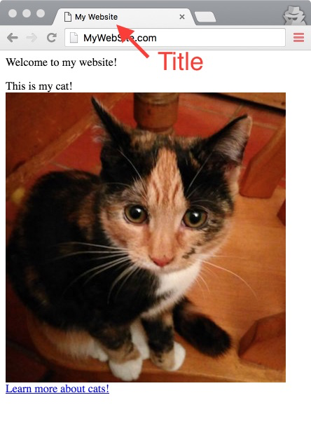
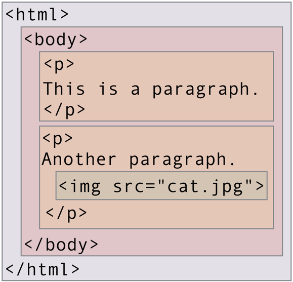
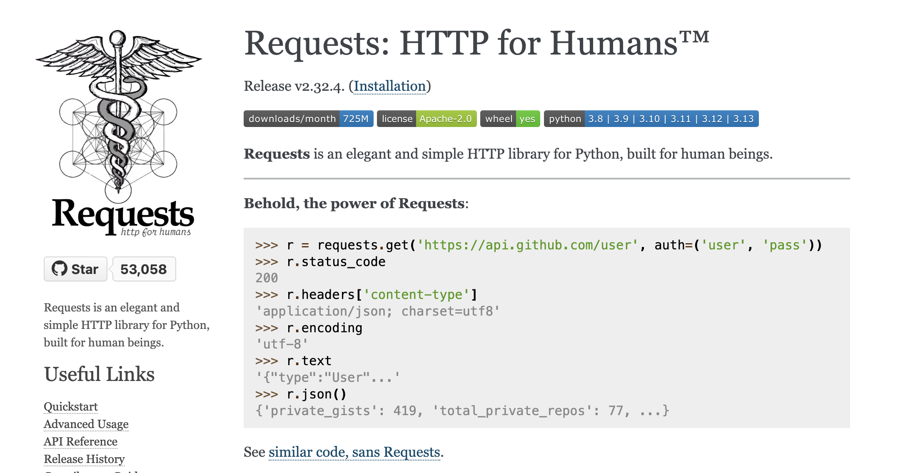

# 网页如何运行？

网络爬虫是一个与网站进行交互的程序。网络爬虫用于创建搜索引擎索引和归档页面，但在我们的例子中用于探索维基百科。编写爬虫前，我们需要先了解网页的工作原理。特别是，需要了解一些 HTML。

如果不熟悉 HTML，也别担心！编写网络爬虫时，不需要了解太多 HTML。

HTML 或*超文本标记语言*是网页的源代码。HTML 文档是描述页面内容的文本文档。其包括文本内容、页面上图像和视频的 URL 以及关于内容排列和样式的信息。网页浏览器会收到原始 HTML，并相应提供格式整齐的多媒体网页。

我们来看一个简单页面的源码，了解一下如何构建 HTML，

```html
<title>My Website</title>
<div id="introduction">
  <p>
    Welcome to my website!
  </p>
</div>    
<div id="image-gallery">
  <p>
    This is my cat!
    
    <a href="https://en.wikipedia.org/wiki/Cat">Learn more about cats!</a>
  </p>
</div>
```

HTML 源代码由嵌套标签组成。第一个标签是标题标签，`<title>`和结束标签`</title>`之间的文本用作页面标题。"



样本页面，标题为 "My Website"

HTML 源代码中的下一个标签是 `<div id="introduction">`。`div` 是 "division" 的缩写，`id="introduction"` 表示该页面的作者将这一部分标注为引言。

我们在该标签下面的几行中可看到 `</div>`。这是 div 的结束标签，表示该段落代码嵌套在 div 中:

```
<p>
  Welcome to my website！
</p>
```

`p` 是 "段落" 的缩写。`<p>` 和其结束标签 `</p>` 之间的文本是提供 HTML 时，显示在屏幕上的内容。可以将该段落称为 div 标签（嵌套在其中）的 "子类"。同样，div 是段落的 "父类"。总而言之，这种父类标签和子类标签的排列创建了一个树结构。

> 词汇注释：术语 "标签" 和 "元素" 密切相关，有时可互换使用。标签是一个 HTML 源码，而元素是在浏览器呈现标签后用户可以看到的可视化组件。



由嵌套标签组成的 HTML 文档树结构。

HTML 文档中的第二个 div 更复杂。它还有一个作为子类的段落标签，该段落标签有自己的子类，`img` 和 `a`。这两个子类标签嵌套在 div 标签内，成为 div 的后代标签。但它们不是 div 的子类，而是 'p` 标签的子类。

**问题 1: 上述 html, `image-gallery` div 里面有多少元素？**

**问题 2:  这些标签中有多少是 `image-gallery` 的直接后代标签？**

**问题 3: 一个标签有多少个父类标签？该数字对于每个 html 文档是一样的。**


## 锚标签

如需爬取网页，还需要了解一个标签类型，即锚标签。我们已经看到一个锚标签：

```
<a href="https://en.wikipedia.org/wiki/Cat">Learn more about cats!</a>
```

锚标签（用`<a></a>`表示，用于创建链接。此示例创建了这样一个链接：

在 `href` 属性中指定链接的目的，开始和结束标签之间的文本即链接的文本。


## 使用开发工具探索 HTML

https://en.wikipedia.org/wiki/DeepSeek

自己试用开发人员工具。浏览任何维基百科的文章，并通过查看其 HTML 源码来回答该问题。

**问题 4: 查找带有 `mw-content-text’ 的 div。该 div 的父类是什么类型的标签？**


## 使用 Python 获取 HTML

> prompt: 如何使用 python 获取 某个 URL 中的网页内容
>
> 使用 deepseek, 查询上述问题




# 天天基金数据采集

## 🔧 准备工作

### 1. 环境准备
首先，我们需要安装以下Python库：
```python
!pip install requests pandas tqdm
```

### 2. 导入必要的库
```python
import requests
import pandas as pd
from time import sleep
from random import randint
from tqdm import tqdm
```

## 🚀 步骤分解

### 第1步：分析网页结构
访问天天基金网站(https://fund.eastmoney.com/data/fundranking.html)，观察：
1. 数据是如何呈现的？
2. 打开开发者工具(F12)，观察Network标签页
3. 尝试切换页面，观察发生了什么？

💡 思考：
- 这是静态页面还是动态加载的？
- 数据的真实来源URL是什么？
- 请求参数中哪些是关键的？


### 第2步：构建请求头

为了模拟真实浏览器访问，我们需要设置请求头。

```python
# 练习：完成get_headers函数
def get_headers():
    """
    返回一个包含User-Agent等信息的字典
    提示：至少需要包含User-Agent和Referer
    """
    pass
```


### 第3步：获取总页数

在抓取数据前，我们需要知道总共有多少页数据。

💡 思考：
- 如何从API响应中提取总记录数？
- 每页显示50条记录，如何计算总页数？

```python
def get_total_pages():
    """
    获取数据总页数
    提示：
    1. 构造请求URL和参数
    2. 发送请求获取响应
    3. 解析响应提取总记录数
    4. 计算总页数
    """
    pass
```

### 第4步：解析基金数据
每页返回的数据需要进行解析和整理。

💡 思考：
- 响应数据的格式是什么？
- 需要提取哪些字段？
- 如何处理百分比等特殊格式？

```python
def parse_fund_data(text):
    """
    解析返回的文本数据
    提示：
    1. 分割文本提取数据部分
    2. 遍历每条基金记录
    3. 提取所需字段
    4. 处理特殊格式（如百分比）
    """
    pass
```

### 第5步：获取单页数据
实现单页数据的获取功能。

```python
def get_single_page(page):
    """
    获取指定页码的数据
    提示：
    1. 构造请求参数
    2. 发送请求
    3. 调用解析函数处理响应
    4. 处理可能的异常
    """
    pass
```

### 第6步：保存数据
将获取的数据保存为CSV格式。

```python
def save_to_csv(data, filename='fund_data.csv'):
    """
    将数据保存为CSV文件
    提示：
    1. 使用pandas DataFrame处理数据
    2. 注意中文编码问题
    """
    pass
```

### 第7步：主函数实现
整合所有功能，实现完整的爬虫程序。

```python
def main():
    """
    主函数：协调各个功能模块
    提示：
    1. 获取总页数
    2. 循环获取每页数据
    3. 添加进度显示
    4. 实现延时机制
    5. 保存最终数据
    """
    pass
```

## 🎯 挑战任务

完成基础功能后，试试这些进阶任务：
1. 添加多线程支持，提高爬取速度
2. 实现断点续爬功能
3. 添加代理IP池
4. 增加数据验证和清洗功能

## 📝 练习建议
1. 先确保理解每个函数的作用
2. 逐步实现每个函数，并及时测试
3. 遇到问题时查看网络请求的细节
4. 注意添加异常处理

## 🚫 常见问题
- 如果遇到请求失败，检查请求头和参数
- 如果数据解析出错，打印原始响应进行分析
- 如果被封IP，考虑增加延时或使用代理

## Bonus: 如何快速进行抓取任意网站
> 我想写一个爬虫, 抓取天天基金网-开放式基金排行网页(https://fund.eastmoney.com/data/fundranking.html#tall;c0;r;s1nzf;pn50;ddesc;qsd20240719;qed20250719;qdii;zq;gg;gzbd;gzfs;bbzt;sfbb)中的数据, 数据一共有多页, 每页通过表格的形式呈现, 例如

> 其他要求:
> 使用 python 实现
> 代码组织方式: 通过函数的方式组织代码
> 最后数据通过 csv 的方式保存